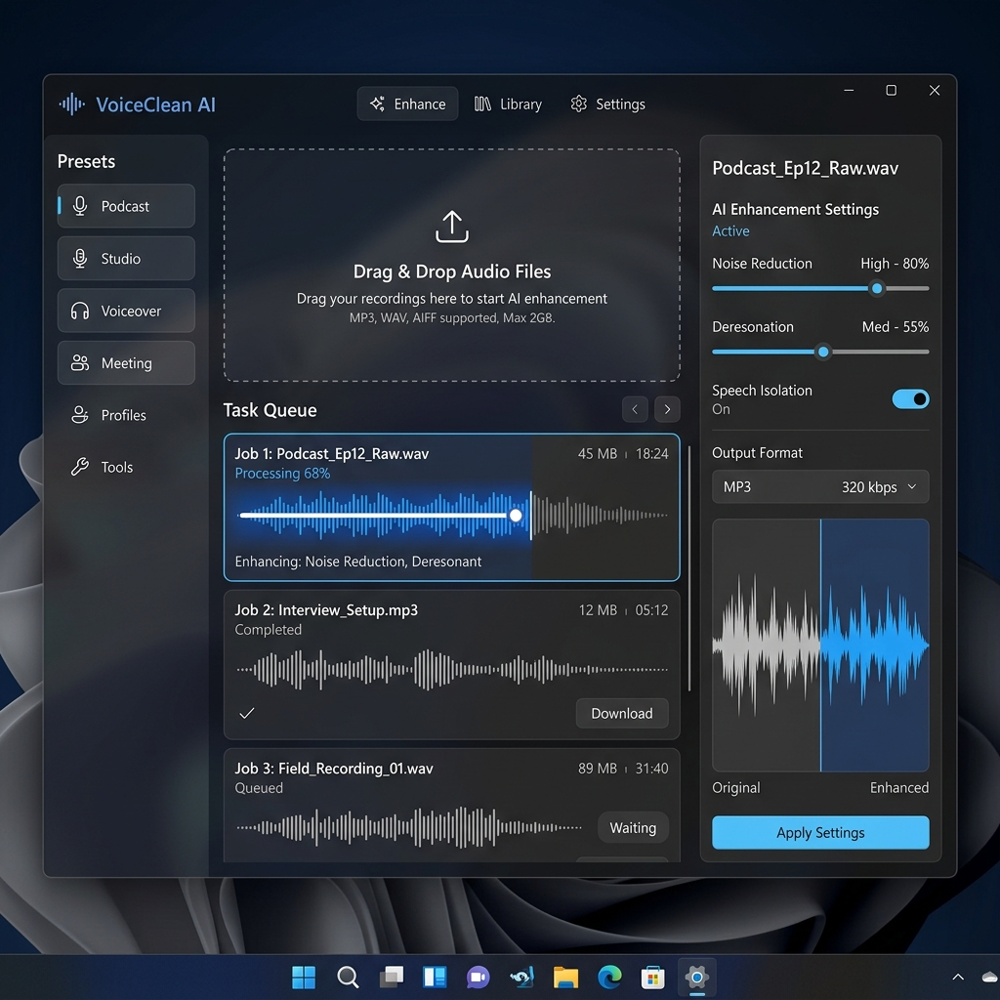

# VoiceClean AI



**VoiceClean AI** は、Windows 11 向けに最適化された、完全にローカルで動作する AI 音声ノイズ除去・強化アプリケーションです。
**VoiceClean AI** is a fully local AI voice noise removal and enhancement application optimized for Windows 11.

最新の AI モデル（Resemble Enhance）と WinUI 3 を組み合わせ、プロフェッショナル品質の音声処理を、プライバシーを重視したローカル環境で提供します。
Combining the latest AI models (Resemble Enhance) with WinUI 3, it provides professional-quality audio processing in a privacy-focused local environment.

## 🌟 主な特徴 / Key Features

- **高性能 AI 推論 / High-Performance AI Inference**: Resemble Enhance による、強力なノイズ除去と音声の復元。(Powerful noise removal and voice restoration using Resemble Enhance.)
- **プライバシー重視 / Privacy-Focused**: すべての処理はローカルで完結。音声ファイルがクラウドにアップロードされることはありません。(All processing is completed locally. Your audio files are never uploaded to the cloud.)
- **モダンな UI / Modern UI**: Windows 11 のデザイン言語（Mica, Acrylic, Fluent Design）に準拠。(Compliant with Windows 11 design language.)
- **高速なメディア処理 / Fast Media Processing**: FFmpeg と連携し、動画ファイルの音声のみを入れ替えるなどの高度な処理が可能。(Integrated with FFmpeg for advanced tasks like swapping audio in video files.)
- **GPU 加速 / GPU Acceleration**: NVIDIA (CUDA) および DirectML をサポートし、ハードウェアの性能を最大限に引き出します。(Supports NVIDIA (CUDA) and DirectML to maximize hardware performance.)
- **バッチ処理 / Batch Processing**: 大量のファイルをドラッグ＆ドロップでキューに追加し、一括処理。(Add multiple files to the queue via drag-and-drop for batch processing.)

## 🛠 テクノロジースタック / Technology Stack

- **Frontend**: WinUI 3, .NET 8 (MVVM)
- **Backend**: Python AI Inference (ONNX Runtime Ready)
- **Audio Core**: Resemble Enhance, FFmpeg
- **GPU Ops**: CUDA, DirectML

## 🚀 はじめかた / Getting Started

### 依存関係 / Dependencies
- .NET 8 SDK
- Python 3.10+
- FFmpeg (パスが通っていること / Must be in PATH)

### 開発環境のセットアップ / Development Setup
1. リポジトリをクローンします。(Clone the repository.)
2. `VoiceCleanAI.slnx` を Visual Studio 2022 で開きます。(Open `VoiceCleanAI.slnx` in Visual Studio 2022.)
3. Python 環境を作成し、依存関係をインストールします：(Create a Python environment and install dependencies:)
   ```bash
   pip install -r src/VoiceCleanAI.Backend/requirements.txt
   ```
4. プロジェクトをビルドして実行します。(Build and run the project.)

## 📖 設計指針とデバッグ報告 / Design Principles & Debug Report
本プロジェクトの設計思想や詳細な要件については、[docs/skills/](docs/skills/) 内のドキュメントを参照してください。
また、今回のUI不具合および音声処理バックエンドの信頼性向上に関するデバッグ・修正完了レポートについては、[docs/walkthrough.md](docs/walkthrough.md) を参照してください。

Refer to the documents in [docs/skills/](docs/skills/) for design philosophy and detailed requirements.
Also, refer to [docs/walkthrough.md](docs/walkthrough.md) for the debug and bug-fixing report regarding UI compile errors and backend stability improvements.

## 📄 ライセンス / License
このプロジェクトは MIT ライセンスの下で公開されています。詳細は [LICENSE](LICENSE) を参照してください。
This project is released under the MIT License. See [LICENSE](LICENSE) for details.

---

Created by Antigravity (Advanced Agentic Coding AI)
